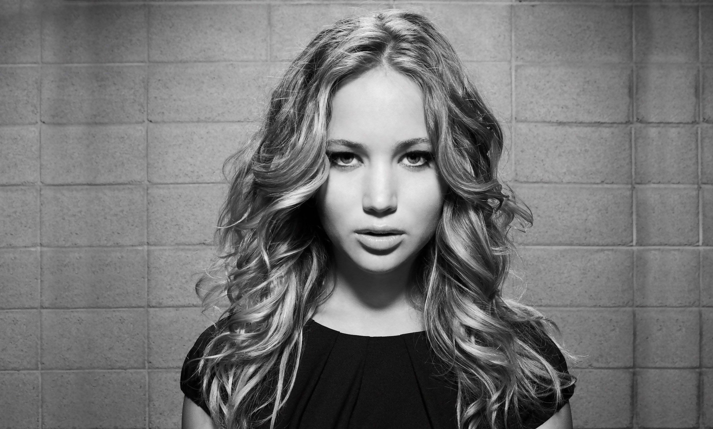
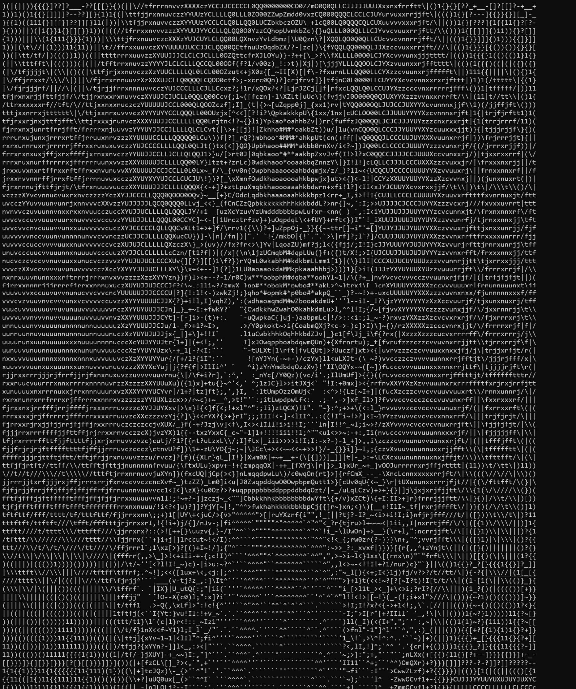
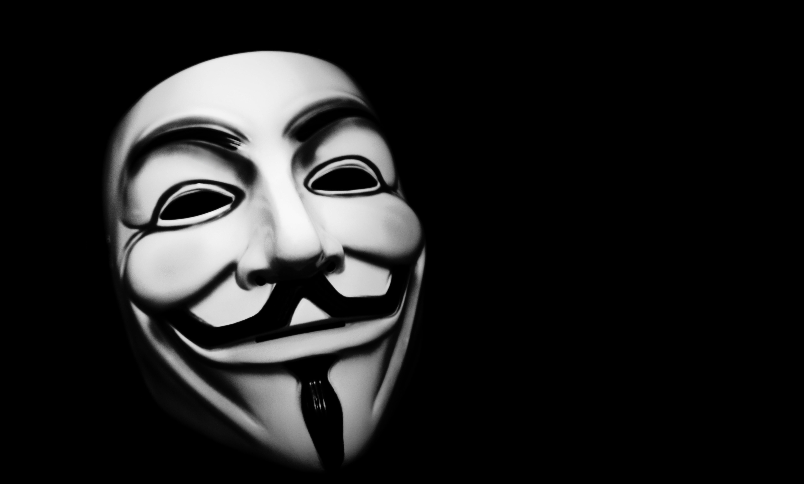
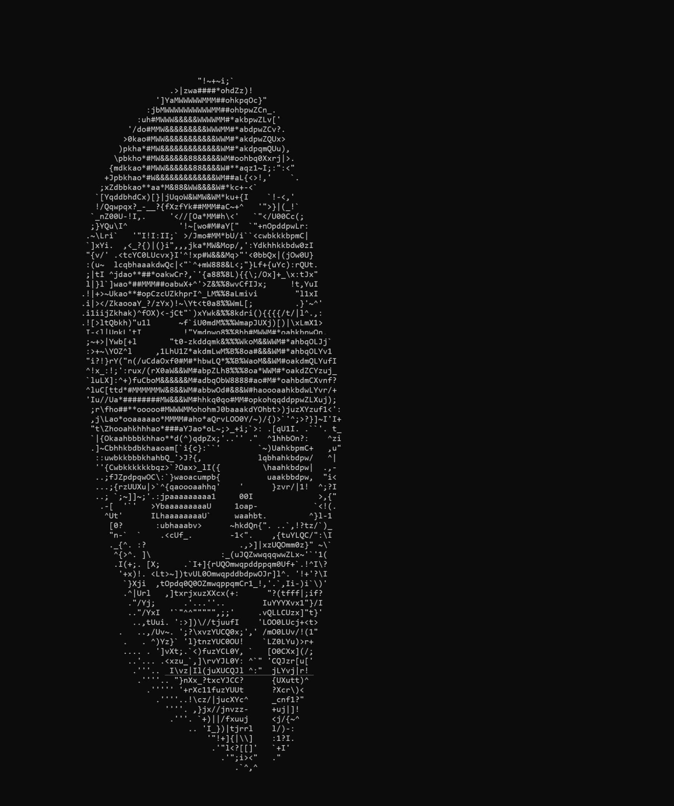
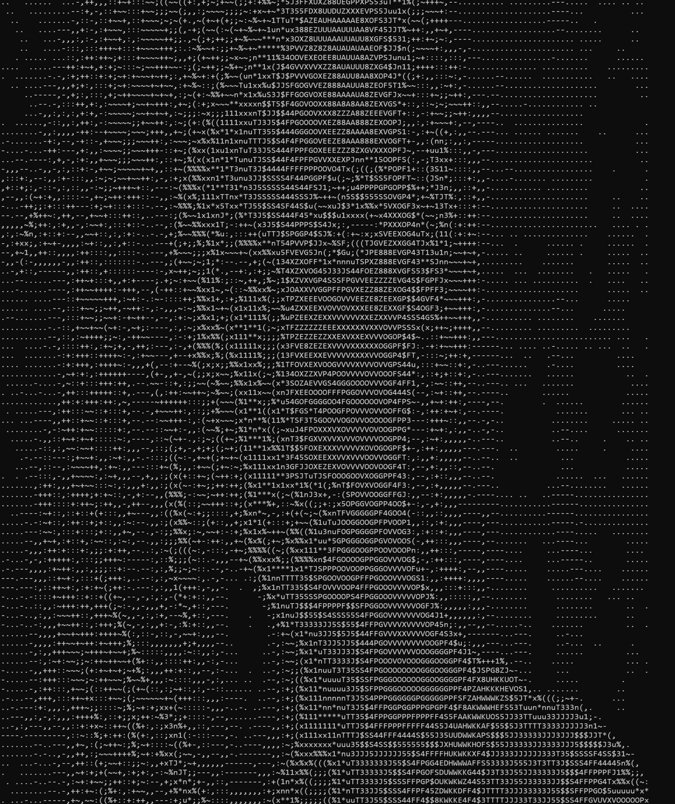
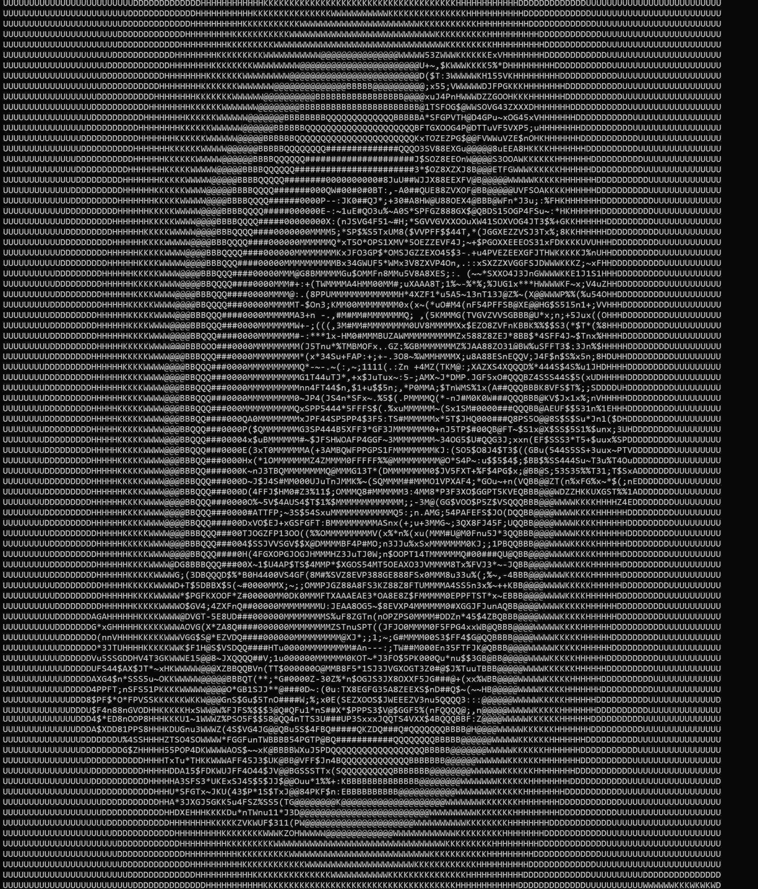

## ___Windows BMP images to ASCII strings___
--------------

__This tool is designed to handle native `Windows` bitmap files (bitmaps native to Windows OS, converts from `Microsoft Photos`, etc.) on `Linux` machines and will not handle bitmaps serialized by `Linux` based softwares such as `GIMP`, `ImageMagick` and the likes unless they meticulously match the binary format of native `Windows` bitmaps.__

- Three ascii palettes are available in `<utils.h>` to choose the characters from. These are arrays of ascii characters ordered in increasing luminance. 

    ```C
    static const char PALETTE_MINIMAL[]  = { ... };
    static const char PALETTE_BASE[]     = { ... };
    static const char PALETTE_EXTENDED[] = { ... };
    ```

- Users can pick any palette by editing the `BASE_PALETTE` and `BLOCK_PALETTE` preprocessor definitions in `<tostring.h>`. These two don't need to be the same.

- For the `RGB` to ascii conversion, a string of mappers are available in `<utils.h>`.

    ```C
    // uses the arithmetic average of the red, green and blue values of pixels
    static inline char __attribute__((always_inline)) arithmetic(const rgbq* const pixel, const char* const palette, unsigned plength)
    
    // scales red, green and blue values of pixels with predefined weights
    static inline char __attribute__((always_inline)) weighted(...)
    
    // uses the average of the minimum and maximum values amongst red, green and blue values of the pixel
    static inline char __attribute__((always_inline)) minmax(...)
    
    // scales red, green and blue values of pixels with predefined weights (different from the weights of  weighted())
    static inline char __attribute__((always_inline)) luminosity(...)
    ```

- When the bitmaps are too big to map each pixel to a character, a different array of mappers are available in `<utils.h>` that will group pixels into square blocks, average over the colour values of the pixels within each block, and map those block averages to a character. These apply the same mathematical formulae as the mappers above, but to block averages.

    ```C
    static inline char __attribute__((always_inline)) arithmetic_blockmapper (float b, float g, float r, const char* const palette, unsigned plength) 
    
    static inline char __attribute__((always_inline)) weighted_blockmapper(...) 
    
    static inline char __attribute__((always_inline)) minmax_blockmapper(...) 
    
    static inline char __attribute__((always_inline)) luminosity_blockmapper(...) 
    
    ```

- Users can pick any mappers by editing the `BASE_MAPPER` and `BLOCK_MAPPER` preprocessor definitions in `<tostring.h>`. These two do not need to be the same.

- However, when using this library, the dispatch details about the mappers aren't necessary as the `to_string()` function will determine if downscaling is required, at runtime and will dispatch the image to the right character mapper.
------
<br>

### ___Examples___

<div> </div>
<div> </div>
<div> </div>
<div> </div>

<br>

### ___Caveats___

- Doesn't support any other image formats.
- Only supports __Windows native bitmaps__ with bottom-up scanline ordering (majority of the bitmaps in contemporary use are of this type). Bitmaps with top-down scanline order will result in a runtime error.
- Not particularly good at capturing specific details in images, especially if the images are large and those details are represented by granular differences in colour gradients (this specificity gets lost in the black and white transformation and downscaling)
- Best results with colour images are obtained when there's a stark contrast between the object of interest and the background (even with a penalizing mapper).
- Monospaced typefaces are critical to get decent renders, non-monospaced typefaces will probably make the patterns incoherent and indistinguishable!
- The distortion in the image dimension during ascii mapping comes from the inherent non-square shaped nature of most typefaces.
Even with monospaced typefaces, characters are taller than they are wide!. This unfortunately makes the ascii representations seem vertically stretched :(

<br>

___For a comprehensive explanation of the implementation, browse the source code, it is thoroughly annotated!.___
