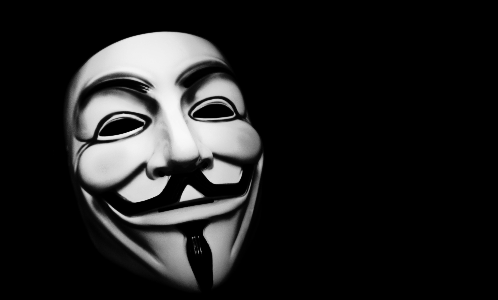
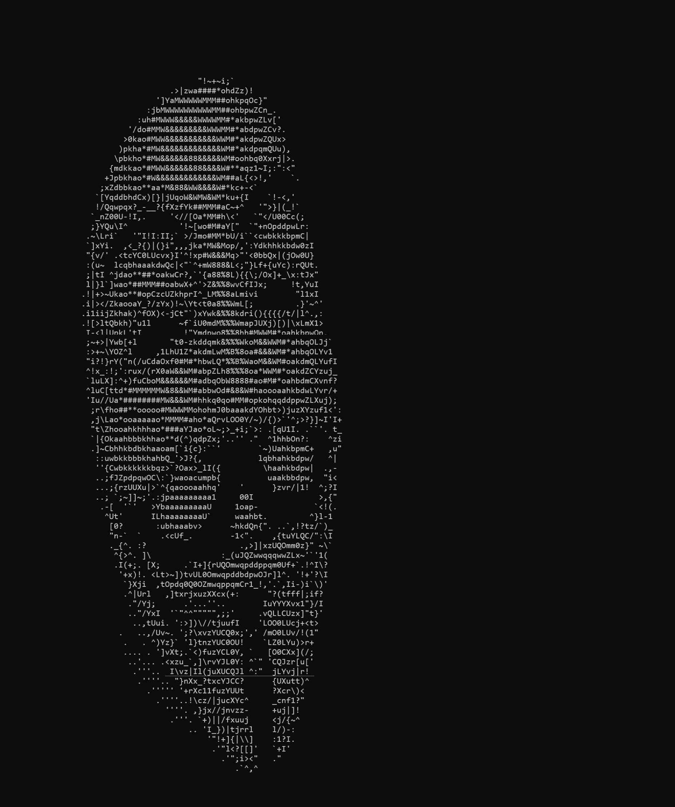
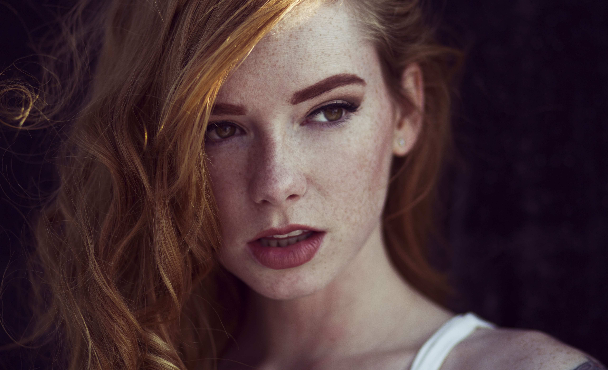
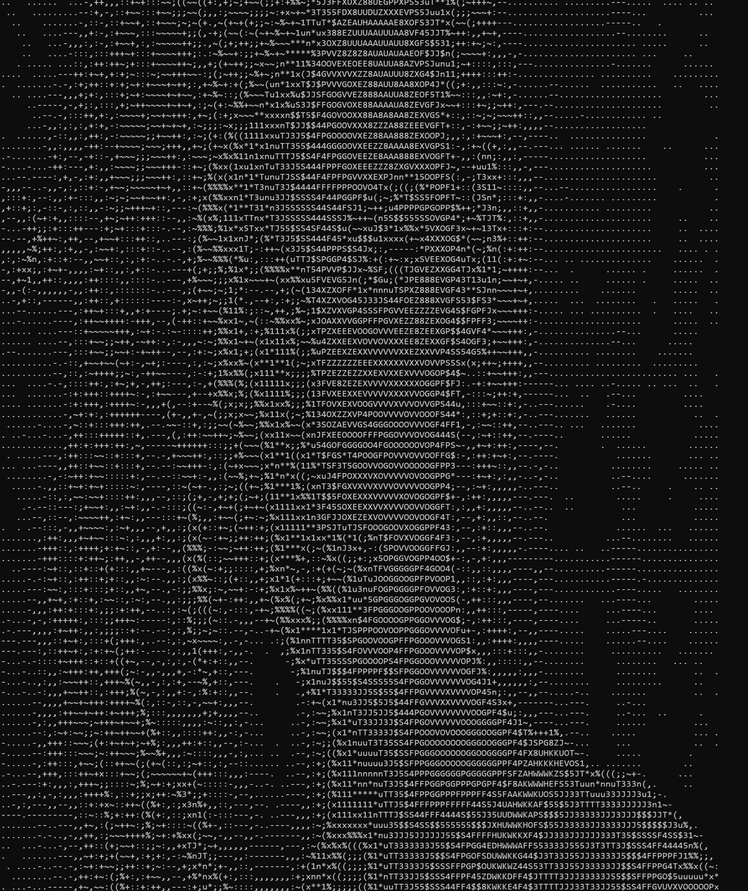
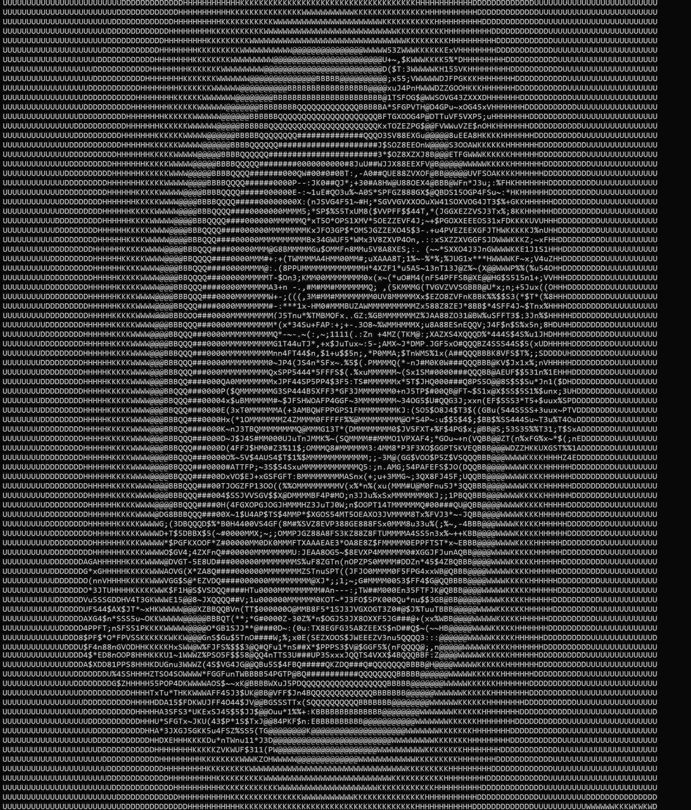
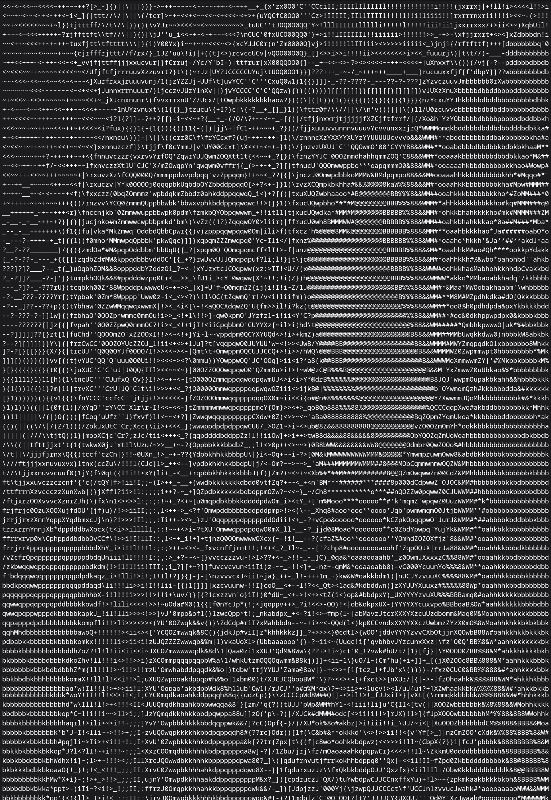
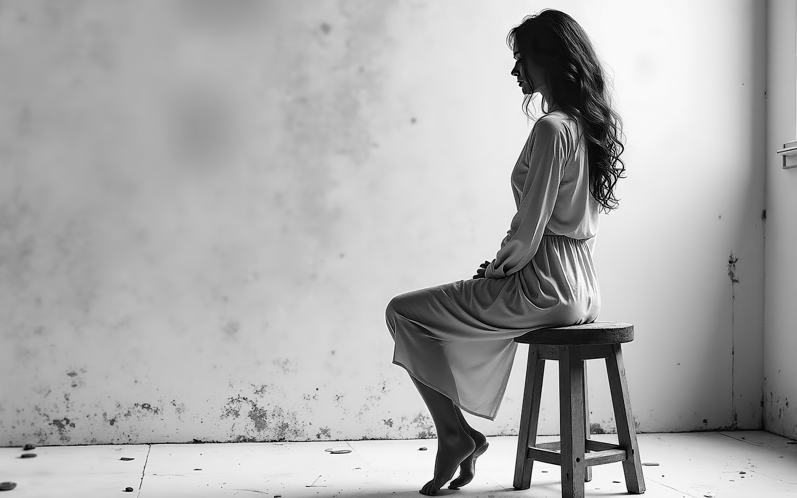

## ___Windows Bitmaps to ASCII arts___
--------------------


__This tool is designed to handle native `Windows` bitmap files (bitmaps native to Windows OS, converts from `Microsoft Photos`, etc.) on `Linux` machines and will not handle bitmaps serialized by `Linux` based softwares such as `GIMP`, `ImageMagick` and the likes unless they meticulously match the binary format of native `Windows` bitmaps.__

- Three ascii palettes are available in `<utils.h>` to choose the characters from. These are arrays of ascii characters ordered in increasing luminance.

    ```C
    static const char PALETTE_MINIMAL[]  = { ... };
    static const char PALETTE_BASE[]     = { ... };
    static const char PALETTE_EXTENDED[] = { ... };
    ```

- Users can pick any palette by editing the `BASE_PALETTE` and `BLOCK_PALETTE` preprocessor definitions in `<tostring.h>`. These two don't need to be the same.

- For the `RGB` pixel to ascii character conversion, a set of functions are available in `<utils.h>`.

    ```C
    // uses the arithmetic average of the red, green and blue values of pixels
    static inline char arithmetic(const rgbq* const pixel, const char* const palette, unsigned plength);

    // scales red, green and blue values of pixels with predefined weights
    static inline char weighted(...);

    // uses the average of the minimum and maximum values amongst red, green and blue values of the pixel
    static inline char minmax(...);

    // scales red, green and blue values of pixels with predefined weights (different from the weights of  weighted())
    static inline char luminosity(...);
    ```

- When the bitmaps are too big to map each pixel to a character (i.e. in the case where the text representation won't fit in the console of a regular screen - 140 characters wide), a different array of mappers are available in `<utils.h>` that will group pixels into square blocks, average over the colour values of the pixels within each block and map those block averages to a character. These apply the same mathematical formulae as the mappers above, but to block averages.

    ```C
    static inline char arithmetic_blockmapper(float b, float g, float r, const char* const palette, unsigned plength);

    static inline char weighted_blockmapper(...);

    static inline char minmax_blockmapper(...);

    static inline char luminosity_blockmapper(...);

    ```

- Users can pick any mappers by editing the `BASE_MAPPER` and `BLOCK_MAPPER` preprocessor definitions in `<tostring.h>`. These two do not need to be the same.

- However, when using this library, the dispatch details about the mappers aren't necessary as the `to_string()` function will determine if downscaling is required, at runtime based on the image dimensions and will dispatch the image to the right functions.

- If the argument `console` of `to_string()` is set to `false`, the function will force a `1:1` pixel to character mapping - regardless of image dimensions. This is useful when you have a huge display or the buffer needs to be serialized to a file instead of being written out to a console.

------

### ___Examples___

Console printed examples using `arithmetic_blockmapper` as the character mapper and `PALETTE_EXTENDED` as the character palette.<br>

<div>   </div>
<div>   </div>
<div>   </div>
<div>   </div><br>

File serialized example using `luminosity` as the character mapper and `PALETTE_BASE` as the character palette.

<div>   </div><br>

### ___Caveats___

- Doesn't support any other image formats.

- Only supports __Windows native bitmaps__ with bottom-up scanline ordering (majority of the `Win32` bitmaps in contemporary use are of this type). Bitmaps with top-down scanline order will result in a runtime error.

- Monospaced typefaces are critical to get decent renders, with non-monospaced typefaces, text lines won't align properly (i.e. two lines with 140 characters will most likely take up different lengths on the terminal), making the text renders incoherent.

- The distortion in the image dimension during ascii mapping comes from the inherent non-square shaped nature of most typefaces. Even with monospaced typefaces, characters are taller than they are wide. This unfortunately makes the ascii representations look vertically stretched (as shown in the examples) :confounded:

- __Caveats specific to console outputs:__
    - When the ascii art is reqested as a console output, a __downscaling__ happens in the character mapping in order to fit the ascii art in the console (140 characters wide - by default), hence it incurs some less desirable side effects.
    - Not particularly good at capturing specific details in images, especially if the images are large and those details are represented by granular differences in colour gradients (this specificity gets lost in the black and white transformation and downscaling).
    - Best results with colour images are obtained when there's a stark contrast between the object of interest and the background.
    
___For a comprehensive explanation of the implementation, browse the source code, it is thoroughly annotated!.___
